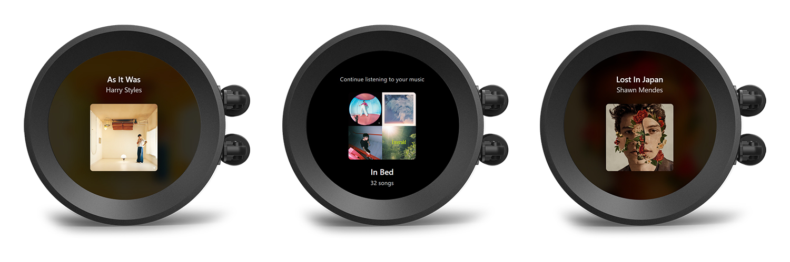

# Kraken Display
This web allows you to use NZXT CAM's Web Integration to display your current playing track on Spotify directly to your NZXT Kraken Display.

**Important Notes**
This app is for my personal use only and I happy to share a release for anyone interested to use it as well. I will continue to add features as requested and continue to provide customizations as I deemed necesarry for the project. 

## Features

- Use your NZXT Kraken Display to show your current playing track on Spotify
- Spotify playlist carousel on idle

## Installation and Setup

**1. Download**
You can get the latest version here.
If you need help, you may contact me on my twitter [@mnrtlntn](https://twitter.com/mnrtlntn)

**2. Install or Setup your IIS** (If you are hosting this application on your device)
I will not go through on how to install or setup your IIS. But, should you need help, you may refer to this [**page**](https://www.howtogeek.com/112455/how-to-install-iis-8-on-windows-8/).

**2.1 Install URL Rewrite Module**
Since I built this application using Angular, if you are hosting this application locally, then you need to install Rewrite Module to your device. You may download it [**here**](https://www.iis.net/downloads/microsoft/url-rewrite).

**3. Set up the application on IIS**
If you were able to install IIS successfully. You should be able to find IIS to your list of apps by typing "IIS" in your Windows search, or by pressing **WIN + R** to open the Run command dialog box and typing **InetMgr.exe** and clicking **OK**

 - Select **Sites** on the left side pane.
 - Under Default Web Site, Right-click and select **Add Application...**
 - For Alias, set it as "**krakendisplay**".
 > If you know what you are doing, you can configure your application however you want.
 - Extract your downloaded application source code and put it under **"C:\inetpub\wwwroot\krakendisplay"**.
  >If you know what you are doing, you can setup IIS however you want and you may place the application source wherever you want.
 - Done

If you were able to setup your application right, you may open your browser and check if the application is working by going to http://localhost/krakendisplay.

This should take you to "Kraken Display Setup" page. You don't need to setup the application from your browser. If you see this page, that means, you are able to successfully setup the application and you may now close this page. 

**4. Create your Spotify Application**
 - Go to the [Spotify Developer page](https://developer.spotify.com/) and sign up or login your account.
 - Once signed up, you'll be able to access the [Dashboard](https://developer.spotify.com/dashboard) that allows you to create your own Spotify application.
 >As this project is for my personal use only, I decided not to go on trouble of having to figure out Spotify limits and decided to make it as flexible so that users can setup their own application
 - I will not go through on how to create your own Spotify application. But once done, you should be able to see your application's **Client Id** and **Client Secret**. You need this information in the setup later.

**5. Setting up your Spotify Application**
 Now you need to configure your application with the Kraken Display's Redirect URI. This will allow Kraken Display to return the necessary token from Spotify to the Kraken Display application.
 - On the dashboard page of your application, select your application and select "**Settings**".
 - At the bottom of the page, select "**Edit**".
 - Under Redirect URIs, add **http://localhost/krakendisplay/settings**.
 > If you setup your application differently on IIS, then you should know where your application is hosted. Make sure to include /settings when setting up the Redirect URI on your spotify Application.

**6. Setup your Kraken Display and Login with Spotify**

 - Open NZXT Cam on your device and select Lighting.
 - For the Display, select "Web Integration".
 - Under Web Integration, Select Custom and click "Edit".
 - On the type or paste URL field, Enter "http://localhost/krakendisplay".
 > If you setup your application differently on IIS, then you should know where your application is hosted.
 - Select the arrow buton one time, and select "Configure".
 - This should open a modal window where the Kraken Display Setup" page will open.
 - From here, follow the application's instruction in setting up your display.
 - Done. Enjoy your Spotify Kraken Display!

# Support
This project will always be free, but if you like it and it was helpful to you, I hope you consider donating to further support my development.

**Follow my accounts**

 - [paypal.me/montolentino](https://paypal.me/montolentino)
 -  [@montolentino_ on Twitter](https://twitter.com/montolentino_)
 -  [@mnrtlntn on Twitter (Dev account)](https://twitter.com/mnrtlntn)
 -  [@montolentino on Instagram](https://instagram.com/montolentino)
